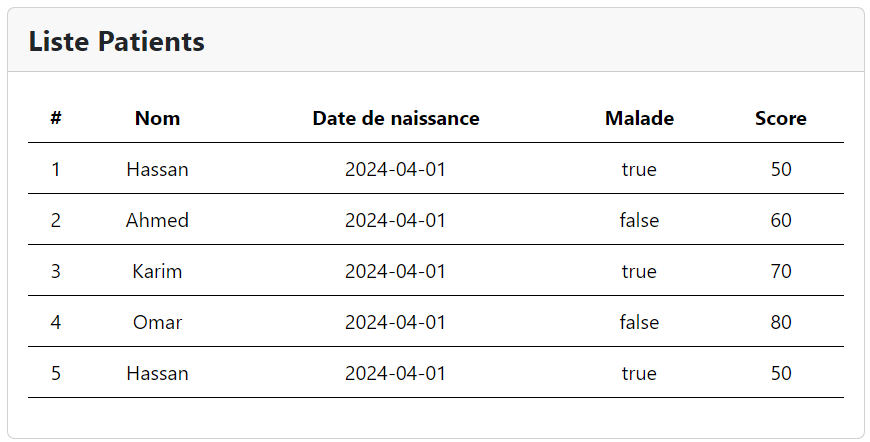
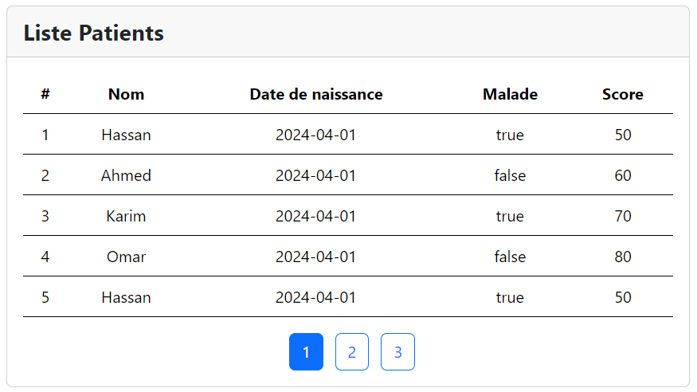
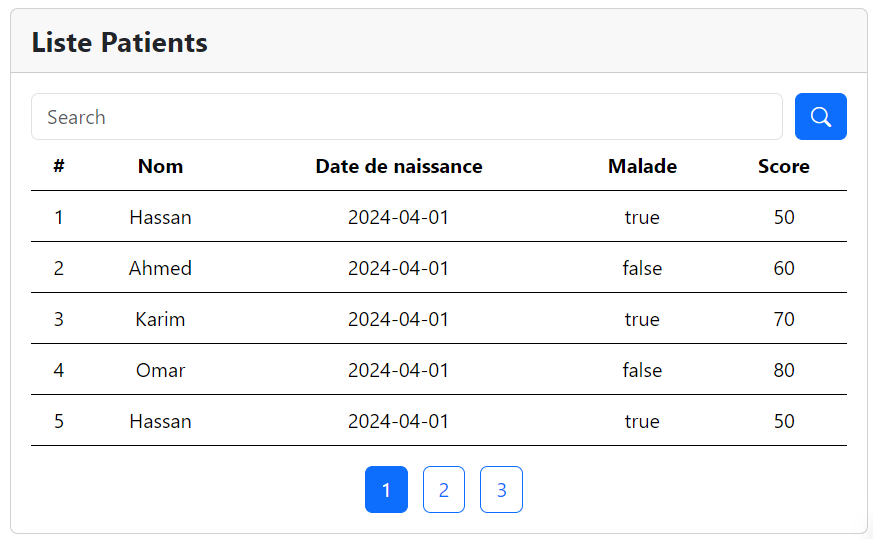
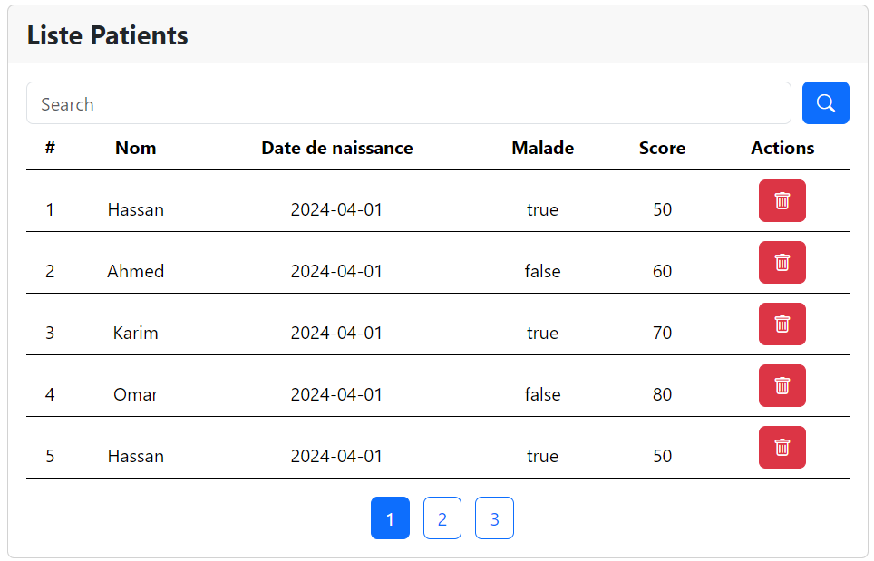
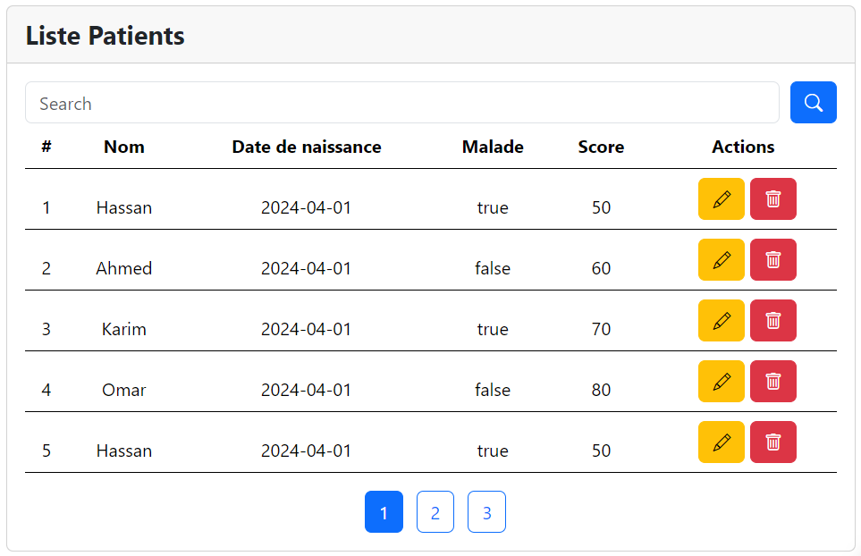
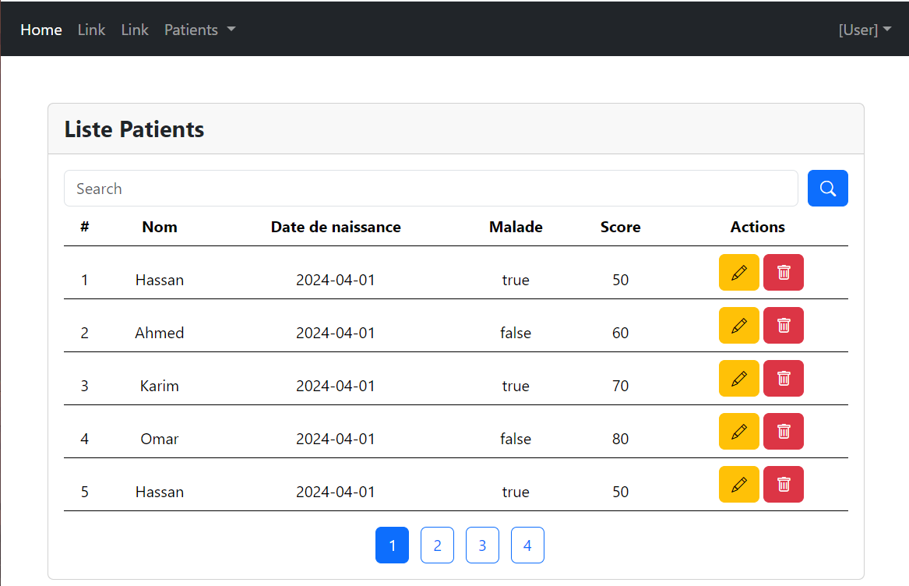
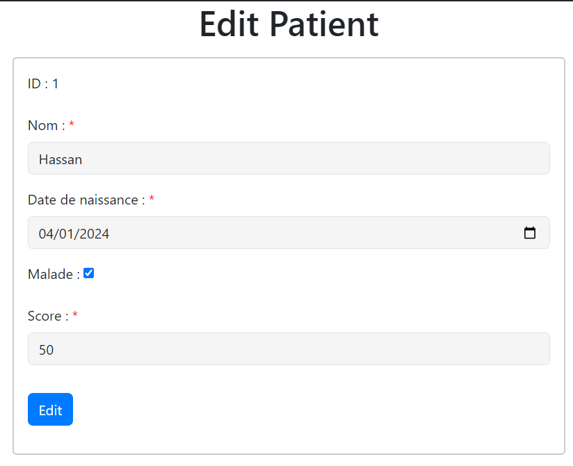
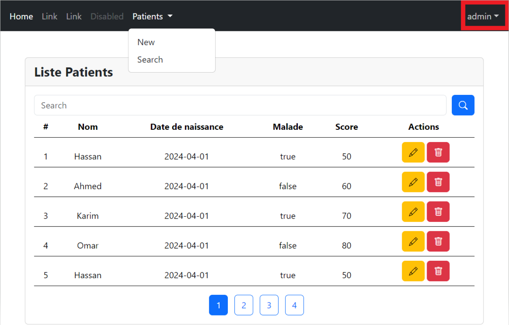
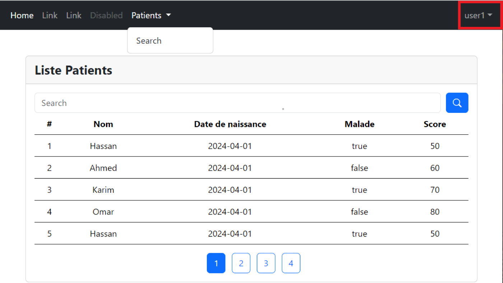

# Spring MVC Spring Data JPA Thymeleaf application

## Introduction

Spring Data JPA est un projet de Spring qui facilite l'accès aux données en utilisant la technologie JPA. Spring Data JPA fournit une interface Repository qui permet de simplifier l'accès aux données. Spring Data JPA fournit également des méthodes pour effectuer des opérations CRUD sur les données.

## Structure du projet

```
   src
    ├───main
    │   ├───java
    │   │   └───ma
    │   │       └───enset
    │   │           └───hospital
    │   │               ├───entities
    │   │               │       Patient.java
    │   │               │
    │   │               ├───repository
    │   │               │       PatientRepository.java
    │   │               │
    │   │               ├───security
    │   │               │   ├───entities
    │   │               │   │       AppUser.java
    │   │               │   │       AppRole.java
    │   │               │   │       
    │   │               │   ├───repository
    │   │               │   │       AppUserRepository.java
    │   │               │   │       AppRoleRepository.java
    │   │               │   │
    │   │               │   ├───service
    │   │               │   │       AccoutService.java
    │   │               │   │       AccountServiceImpl.java
    │   │               │   │       UserDetailServiceImpl.java
    │   │               │   │
    │   │               │   └───SecurityConfig.java
    │   │               │
    │   │               ├───web
    │   │               │       PatientController.java
    │   │               │       SecurityController.java
    │   │               │
    │   │               └───HospitalApplication.java
    │   └───resources
    │       ├───templates
    │       │       editPatient.html
    │       │       formPatients.html
    │       │       login.html
    │       │       notAuthorized.html
    │       │       patients.html
    │       │       template1.html
    │       │       
    │       ├───application.properties
    │       └───schema.sql
    └───test
        └───java
```

## Partie 1 : Spring MVC Thymeleaf Spring Data JPA

### Travail à faire
Créer une application Web JEE basée sur Spring MVC, Thymeleaf et Spring Data JPA qui permet de gérer les patients. L'application doit permettre les fonctionnalités suivantes :
1. Afficher les patients
2. Faire la pagination
3. Chercher les patients
4. Supprimer un patient
5. Faire des améliorations supplémentaires

Class Patient.java :
```java
@Entity
@Data @NoArgsConstructor @AllArgsConstructor @Builder
public class Patient {
    @Id @GeneratedValue(strategy = GenerationType.IDENTITY)
    private Long id;
    private String nom;
    private Date dateNaissance;
    private boolean malade;
    private int score;
}
```
Code html (patient.html) pour toutes les tâches de cette partie 1 :
```html
<!DOCTYPE html>
<html lang="en" xmlns:th="http://www.thymeleaf.org"
      xmlns:layout="http://www.ultraq.net.nz/thymeleaf/layout"
      layout:decorate="template1">
<head>
    <meta charset="UTF-8">
    <title>Patients</title>
    <link rel="stylesheet" href="/webjars/bootstrap/5.3.3/css/bootstrap.min.css">
    <link rel="stylesheet" href="/webjars/bootstrap-icons/1.11.3/font/bootstrap-icons.css">
    <script src="/webjars/jquery/3.6.4/jquery.min.js"></script>
    <style>
        .searchArea .input-button-container {
            display: flex;
            align-items: center;
            gap: 10px;
        }
        .searchArea .input-button-container input {
            flex-grow: 1;
        }
    </style>
</head>
<body>
<div layout:fragment="content1">
    <div class="p-5">
        <div class="card">
            <div class="card-header fs-4"><b>Liste Patients</b></div>
            <div class="card-body">
                <div class="searchArea">
                    <form method="get" th:action="@{/user/index}">
                        <div class="input-button-container">
                            <input placeholder="Search" type="text" class="form-control" name="keyword" th:value="${keyword}">
                            <button type="submit" class="btn btn-primary">
                                <i class="bi bi-search"></i>
                            </button>
                        </div>
                    </form>
                </div>
                <table class="table" style="border: black">
                    <thead>
                    <tr>
                        <th class="text-center">#</th>
                        <th class="text-center">Nom</th>
                        <th class="text-center">Date de naissance</th>
                        <th class="text-center">Malade</th>
                        <th class="text-center">Score</th>
                        <th class="text-center" th:if="${#authorization.expression('hasRole(''ADMIN'')')}">Actions</th>
                    </tr>
                    <tr th:each="p:${listPatients}">
                        <td class="text-center" th:text="${p.id}"></td>
                        <td class="text-center" th:text="${p.nom}"></td>
                        <td class="text-center" th:text="${p.dateNaissance}"></td>
                        <td class="text-center" th:text="${p.malade}"></td>
                        <td class="text-center" th:text="${p.score}"></td>
                        <td class="text-center" th:if="${#authorization.expression('hasRole(''ADMIN'')')}">
                            <a th:href="@{/admin/editPatient(id=${p.id}, keyword=${keyword}, page=${currentPage})}"
                               class="btn btn-warning ms-2">
                                <i class="bi bi-pencil"></i>
                            </a>
                            <a onclick="return confirm('Are you sure ?')"
                               th:href="@{/admin/delete(id=${p.id}, keyword=${keyword}, page=${currentPage})}"
                               class="btn btn-danger">
                                <i class="bi bi-trash"></i>
                            </a>
                        </td>
                    </tr>
                    </thead>
                </table>
                <ul class="nav nav-pills d-flex justify-content-center flex-wrap gap-1">
                    <li th:each="value, item:${pages}">
                        <a th:href="@{/user/index(page=${item.index}, keyword=${keyword})}"
                           th:class="${(currentPage==item.index) ? 'btn btn-primary ms-2' : 'btn btn-outline-primary ms-2'}"
                           th:text="${1+item.index}"></a>
                    </li>
                </ul>
            </div>
        </div>
    </div>
</body>
</html>
```
Code PatientController.java qui gère toutes les fonctionnalités de cette partie 1 :
```java
@Controller
@AllArgsConstructor
public class PatientController {
    private PatientRepository patientRepository;
    @GetMapping("/index")
    public String index(Model model,
                        @RequestParam(name = "page", defaultValue = "0") int p,
                        @RequestParam(name = "size", defaultValue = "5") int s,
                        @RequestParam(name = "keyword", defaultValue = "") String kw){
        Page<Patient> patientPage = patientRepository.findByNomContains(kw, PageRequest.of(p, s));
        model.addAttribute("listPatients", patientPage.getContent());
        model.addAttribute("pages", new int[patientPage.getTotalPages()]);
        model.addAttribute("currentPage", p);
        model.addAttribute("keyword", kw);
        return "patients";
    }
    @GetMapping("/")
    public String home(){
        return "redirect:/index";
    }
    @GetMapping("/patients")
    @ResponseBody
    public List<Patient> patients(){
        return patientRepository.findAll();
    }
    @GetMapping("/delete")
    public String delete(Long id, String keyword, int page){
        patientRepository.deleteById(id);
        return "redirect:/index?page="+page+"&keyword="+keyword;
    }
    @GetMapping( "/editPatient")
    public String editPatient(Model model, Long id, String keyword, int page){
        Patient patient = patientRepository.findById(id).orElse(null);
        if (patient == null) throw new RuntimeException("Patient not found");
        model.addAttribute("patient", patient);
        model.addAttribute("keyword", keyword);
        model.addAttribute("page", page);
        return "editPatient";
    }
}
```
### La tâche 1



### La tâche 2



### La tâche 3



### La tâche 4



### La tâche 5



### Partie 2 : Spring Boot Spring MVC Thymeleaf Spring Data JPA

### Travail à faire
1. Créer une page template
2. Faire la validation des formulaires

### La tâche 1
Code html (template1.html) pour la page template :
```html
<!DOCTYPE html>
<html lang="en" xmlns:th="http://www.thymeleaf.org" xmlns:layout="http://www.ultraq.net.nz/thymeleaf/layout">
<head>
    <meta charset="UTF-8">
    <title>Title</title>
    <link rel="stylesheet" href="/webjars/bootstrap/5.3.3/css/bootstrap.min.css">
    <link rel="stylesheet" href="/webjars/bootstrap-icons/1.11.3/font/bootstrap-icons.css">
    <script src="/webjars/jquery/3.6.4/jquery.min.js"></script>
    <script src="/webjars/bootstrap/5.3.3/js/bootstrap.bundle.min.js"></script>
</head>
<body>
<nav class="navbar navbar-expand-sm bg-dark navbar-dark">
    <div class="container-fluid">
        <ul class="navbar-nav">
            <li class="nav-item">
                <a class="nav-link active" th:href="@{/index}">Home</a>
            </li>
            <li class="nav-item dropdown">
                <a class="nav-link dropdown-toggle" href="#" role="button" data-bs-toggle="dropdown">
                    Patients
                </a>
                <ul class="dropdown-menu">
                    <li><a class="dropdown-item" th:href="@{/formPatients}">New</a></li>
                    <li><a class="dropdown-item" th:href="@{/index}">Search</a></li>
                </ul>
            </li>
        </ul>
        <ul class="navbar-nav">
            <li class="nav-item dropdown">
                <a class="nav-link dropdown-toggle" href="#" role="button" data-bs-toggle="dropdown">[User]/a>
                <ul class="dropdown-menu">
                    <li><a class="dropdown-item" href="#">Logout</a></li>
                    <li><a class="dropdown-item" href="#">Profile</a></li>
                </ul>
            </li>
        </ul>
    </div>
</nav>
<section layout:fragment="content1">

</section>
</body>
</html>
```


### La tâche 2
Code html (formPatients.html) pour le formulaire d'ajouter les patients :
```html
<!DOCTYPE html>
<html lang="en" xmlns:th="http://www.thymeleaf.org"
      xmlns:layout="http://www.ultraq.net.nz/thymeleaf/layout"
      layout:decorate="template1">
<head>
    <meta charset="UTF-8">
    <title>Form Patients</title>
    <link rel="stylesheet" href="/webjars/bootstrap/5.3.3/css/bootstrap.min.css">
    <link rel="stylesheet" href="/webjars/bootstrap-icons/1.11.3/font/bootstrap-icons.css">
    <script src="/webjars/jquery/3.6.4/jquery.min.js"></script>
    <style>
        .form-group {
            margin-bottom: 1rem;
        }
        .form-group label {
            display: block;
            margin-bottom: 0.5rem;
        }
        .form-group input {
            background-color: #F5F5F5;
        }
        .form-group .form-control {
            margin-bottom: 1rem;
        }
        .form-group .text-danger {
            display: block;
            margin-bottom: 1rem;
        }
        .form-group.required label::after {
            content: ' *';
            color: red;
        }
        .btn-primary {
            background-color: #007bff;
            border-color: #007bff;
        }
        .btn-primary:hover {
            background-color: #0069d9;
            border-color: #0062cc;
        }
        .form-container {
            border: 2px solid #ccc;
            border-radius: 5px;
            padding: 1rem;
            margin-bottom: 1rem;
        }
    </style>
</head>
<body>
<div layout:fragment="content1">
    <div class="container">
        <div class="row">
            <div class="col-md-6 offset-md-3">
                <h1 class="mb-3 text-center">New Patient</h1>
                <div class="form-container">
                    <form method="post" th:action="@{save}">
                        <div class="form-group required">
                            <label for="nom">Nom : </label>
                            <input id="nom" class="form-control" type="text" name="nom" th:value="${patient.nom}" required>
                            <span class="text-danger" th:errors="${patient.nom}"></span>
                        </div>
                        <div class="form-group required">
                            <label for="dateNaissance">Date de naissance : </label>
                            <input id="dateNaissance" class="form-control" type="date" name="dateNaissance" th:value="${patient.dateNaissance}" required>
                            <span class="text-danger" th:errors="${patient.dateNaissance}"></span>
                        </div>
                        <div class="form-group">
                            <label for="malade">Malade : </label>
                            <div class="form-check">
                                <input id="malade" type="checkbox" name="malade" th:checked="${patient.malade}" class="form-check-input">
                                <label for="malade" class="form-check-label">Yes</label>
                            </div>
                            <span class="text-danger" th:errors="${patient.malade}"></span>
                        </div>
                        <div class="form-group required">
                            <label for="score">Score : </label>
                            <input id="score" class="form-control" type="number" name="score" th:value="${patient.score}" required>
                            <span class="text-danger" th:errors="${patient.score}"></span>
                        </div>
                        <div class="form-group">
                            <button type="submit" class="btn btn-primary">Save</button>
                        </div>
                    </form>
                </div>
            </div>
        </div>
    </div>
</div>
</body>
</html>
```


Code html (editPatients.html) pour le formulaire de modifier les patients :
```html
<!DOCTYPE html>
<html lang="en" xmlns:th="http://www.thymeleaf.org"
      xmlns:layout="http://www.ultraq.net.nz/thymeleaf/layout"
      layout:decorate="template1">
<head>
    <meta charset="UTF-8">
    <title>Edit Patient</title>
    <link rel="stylesheet" href="/webjars/bootstrap/5.3.3/css/bootstrap.min.css">
    <link rel="stylesheet" href="/webjars/bootstrap-icons/1.11.3/font/bootstrap-icons.css">
    <script src="/webjars/jquery/3.6.4/jquery.min.js"></script>
    <style>
        .form-group {
            margin-bottom: 1rem;
        }
        .form-group label {
            margin-bottom: 0.5rem;
        }
        .form-group input {
            background-color: #F5F5F5;
        }
        .form-group .form-control {
            margin-bottom: 1rem;
        }
        .form-group .text-danger {
            display: block;
            margin-bottom: 1rem;
        }
        .form-group.required label::after {
            content: ' *';
            color: red;
        }
        .btn-primary {
            background-color: #007bff;
            border-color: #007bff;
        }
        .btn-primary:hover {
            background-color: #0069d9;
            border-color: #0062cc;
        }
        .form-container {
            border: 2px solid #ccc;
            border-radius: 5px;
            padding: 1rem;
            margin-bottom: 1rem;
        }
    </style>
</head>
<body>
<div layout:fragment="content1">
    <div class="container">
        <div class="row">
            <div class="col-md-6 offset-md-3">
                <h1 class="mb-3 text-center">Edit Patient</h1>
                <div class="form-container">
                    <form method="post" th:action="@{save(page=${page}, keyword=${keyword})}">
                        <div class="form-group">
                            <label>ID : </label>
                            <label th:text="${patient.id}"></label>
                            <input class="form-control" type="hidden" name="id" th:value="${patient.id}">
                        </div>
                        <div class="form-group required">
                            <label for="nom">Nom : </label>
                            <input id="nom" class="form-control" type="text" name="nom" th:value="${patient.nom}" required>
                            <span class="text-danger" th:errors="${patient.nom}"></span>
                        </div>
                        <div class="form-group required">
                            <label for="dateNaissance">Date de naissance : </label>
                            <input id="dateNaissance" class="form-control" type="date" name="dateNaissance" th:value="${patient.dateNaissance}" required>
                            <span class="text-danger" th:errors="${patient.dateNaissance}"></span>
                        </div>
                        <div class="form-group">
                            <label for="malade">Malade : </label>
                            <input id="malade" type="checkbox" name="malade" th:checked="${patient.malade}">
                            <span class="text-danger" th:errors="${patient.malade}"></span>
                        </div>
                        <div class="form-group required">
                            <label for="score">Score : </label>
                            <input id="score" class="form-control" type="number" name="score" th:value="${patient.score}" required>
                            <span class="text-danger" th:errors="${patient.score}"></span>
                        </div>
                        <div class="form-group">
                            <button type="submit" class="btn btn-primary mt-3">Edit</button>
                        </div>
                    </form>
                </div>
            </div>
         </div>
    </div>
</div>
</body>
</html>
```


Alors, pour faire la validation de ces formulaires, il faut :
1. Ajouter la dépendence de Spring boot validation dans le fichier pom.xml :
```xml
<dependency>
    <groupId>org.springframework.boot</groupId>
    <artifactId>spring-boot-starter-validation</artifactId>
</dependency>
```
2. Ajouter les annotations de validation dans la classe Patient.java :
```java
@Entity
@Data @NoArgsConstructor @AllArgsConstructor @Builder
public class Patient {
    @Id @GeneratedValue(strategy = GenerationType.IDENTITY)
    private Long id;
    @Column(length = 50)
    @NotEmpty @Size(min = 4, max = 20)
    private String nom;
    @Temporal(TemporalType.DATE)
    @DateTimeFormat(pattern = "yyyy-MM-dd")
    private Date dateNaissance;
    private boolean malade;
    @DecimalMin("40")
    private int score;
}
```
3. Ajouter les annotations de validation dans le PatientController.java, utiliser **BindingResult** pour vérifier les erreurs de validation at la notation **@valid** :
```java
@Controller
@AllArgsConstructor
public class PatientController {
    // ...
    //  Code précédent
    //...
    @PostMapping("/save")
    public String save(@Valid Patient patient, BindingResult bindingResult){
        if (bindingResult.hasErrors()) return "formPatients";
        patientRepository.save(patient);
        return "redirect:/index";
    }
}
```
4. Ajouter les annotations de validation dans les formulaires html :
```html
<div class="form-group required">
    <label for="nom">Nom : </label>
    <input id="nom" class="form-control" type="text" name="nom" th:value="${patient.nom}" required>
    <span class="text-danger" th:errors="${patient.nom}"></span>
</div>
<div class="form-group required">
    <label for="dateNaissance">Date de naissance : </label>
    <input id="dateNaissance" class="form-control" type="date" name="dateNaissance" th:value="${patient.dateNaissance}" required>
    <span class="text-danger" th:errors="${patient.dateNaissance}"></span>
</div>
<div class="form-group required">
    <label for="score">Score : </label>
    <input id="score" class="form-control" type="number" name="score" th:value="${patient.score}" required>
    <span class="text-danger" th:errors="${patient.score}"></span>
</div>
```

### Partie 3 : Sécurité avec Spring security

### Travail à faire
Sécuriser l'application en utilisant Spring Security. L'application doit permettre les fonctionnalités suivantes :
1. InMemory Authentication
2. JDBC Authentication
3. UserDetails Service

Pour commencer cette partie, il faut ajouter d'abord les dépendences de Spring Security dans le fichier pom.xml :
```xml
<dependency>
    <groupId>org.springframework.boot</groupId>
    <artifactId>spring-boot-starter-security</artifactId>
</dependency>

<dependency>
<groupId>org.thymeleaf.extras</groupId>
<artifactId>thymeleaf-extras-springsecurity6</artifactId>
<version>3.1.0.M1</version>
</dependency>
```
Après, il faut ajouter la configuration de Spring Security dans la classe SecurityConfig.java :

```java
@Configuration
@EnableWebSecurity
@EnableMethodSecurity(prePostEnabled = true)
public class SecurityConfig {
    @Bean
    public SecurityFilterChain securityFilterChain(HttpSecurity httpSecurity) throws Exception {
        return httpSecurity
                .formLogin(ar->ar.loginPage("/login").defaultSuccessUrl("/").permitAll())
                .rememberMe(Customizer.withDefaults())
                .authorizeHttpRequests(ar->ar.requestMatchers("/webjars/**").permitAll())
                .authorizeHttpRequests(ar->ar.requestMatchers("/deletePatient/**").hasRole("ADMIN"))
                .authorizeHttpRequests(ar->ar.requestMatchers("/admin/**").hasRole("ADMIN"))
                .authorizeHttpRequests(ar->ar.requestMatchers("/user/**").hasRole("USER"))
                .authorizeHttpRequests(ar->ar.anyRequest().authenticated())
                .exceptionHandling(ar->ar.accessDeniedPage("/notAuthorized"))
                .build();
    }
}
```
Après, il faut modifier le code de template1.html pour afficher le nom de l'utilisateur connecté et de PatientController.java pour gérer les autorisations des utilisateurs :

Nouveau code pour template1.html :
```html
<!DOCTYPE html>
<html lang="en" xmlns:th="http://www.thymeleaf.org" xmlns:layout="http://www.ultraq.net.nz/thymeleaf/layout">
<head>
    <meta charset="UTF-8">
    <title>Title</title>
    <link rel="stylesheet" href="/webjars/bootstrap/5.3.3/css/bootstrap.min.css">
    <link rel="stylesheet" href="/webjars/bootstrap-icons/1.11.3/font/bootstrap-icons.css">
    <script src="/webjars/jquery/3.6.4/jquery.min.js"></script>
    <script src="/webjars/bootstrap/5.3.3/js/bootstrap.bundle.min.js"></script>
</head>
<body>
    <nav class="navbar navbar-expand-sm bg-dark navbar-dark">
        <div class="container-fluid">
            <ul class="navbar-nav">
                <li class="nav-item">
                    <a class="nav-link active" th:href="@{/user/index}">Home</a>
                </li>
                <li class="nav-item">
                    <a class="nav-link" href="#">Link</a>
                </li>
                <li class="nav-item">
                    <a class="nav-link" href="#">Link</a>
                </li>
                <li class="nav-item">
                    <a class="nav-link disabled" href="#">Disabled</a>
                </li>
                <li class="nav-item dropdown">
                    <a class="nav-link dropdown-toggle" href="#" role="button" data-bs-toggle="dropdown">
                        Patients
                    </a>
                    <ul class="dropdown-menu">
                        <li th:if="${#authorization.expression('hasRole(''ADMIN'')')}">
                            <a class="dropdown-item" th:href="@{/admin/formPatients}">New</a>
                        </li>
                        <li>
                            <a class="dropdown-item" th:href="@{/user/index}">Search</a>
                        </li>
                    </ul>
                </li>
            </ul>
            <ul class="navbar-nav">
                <li class="nav-item dropdown">
                    <a class="nav-link dropdown-toggle" href="#" role="button" data-bs-toggle="dropdown" th:text="${#authentication.name}">

                    </a>
                    <ul class="dropdown-menu">
                        <li>
                            <form method="post" th:action="@{/logout}">
                                <button class="dropdown-item" type="submit">Logout</button>
                            </form>
                        </li>
                        <li><a class="dropdown-item" href="#">Profile</a></li>
                    </ul>
                </li>
            </ul>
        </div>
    </nav>
    <section layout:fragment="content1">

    </section>
</body>
</html>
```
Nouveau code pour PatientController.java :
```java
@Controller
@AllArgsConstructor
public class PatientController {
    private PatientRepository patientRepository;
    @GetMapping("/user/index")
    public String index(Model model,
                        @RequestParam(name = "page", defaultValue = "0") int p,
                        @RequestParam(name = "size", defaultValue = "5") int s,
                        @RequestParam(name = "keyword", defaultValue = "") String kw){
        Page<Patient> patientPage = patientRepository.findByNomContains(kw, PageRequest.of(p, s));
        model.addAttribute("listPatients", patientPage.getContent());
        model.addAttribute("pages", new int[patientPage.getTotalPages()]);
        model.addAttribute("currentPage", p);
        model.addAttribute("keyword", kw);
        return "patients";
    }
    @GetMapping("/")
    public String home(){
        return "redirect:/user/index";
    }

    @GetMapping("/admin/patients")
    @ResponseBody
    public List<Patient> patients(){
        return patientRepository.findAll();
    }

    @GetMapping("/admin/delete")
    public String delete(Long id, String keyword, int page){
        patientRepository.deleteById(id);
        return "redirect:/user/index?page="+page+"&keyword="+keyword;
    }

    @GetMapping("/admin/formPatients")
    public String formPatients(Model model){
        model.addAttribute("patient", new Patient());
        return "formPatients";
    }

    @PostMapping(path = "/admin/save")
    public String save(Model model, @Valid Patient patient, BindingResult bindingResult,
                       @RequestParam(defaultValue = "") String keyword,
                       @RequestParam(defaultValue = "0") int page){
        if(bindingResult.hasErrors()) return "formPatients";
        patientRepository.save(patient);
        return "redirect:/user/index?page="+page+"&keyword="+keyword;
    }

    @GetMapping( "/admin/editPatient")
    public String editPatient(Model model, Long id, String keyword, int page){
        Patient patient = patientRepository.findById(id).orElse(null);
        if (patient == null) throw new RuntimeException("Patient not found");
        model.addAttribute("patient", patient);
        model.addAttribute("keyword", keyword);
        model.addAttribute("page", page);
        return "editPatient";
    }
}
```
### La tâche 1
1. Ajouter la configuration de l'authentification InMemory dans la classe SecurityConfig.java :
```java
@Configuration
@EnableWebSecurity
@EnableMethodSecurity(prePostEnabled = true)
@AllArgsConstructor
public class SecurityConfig {
    private PasswordEncoder passwordEncoder;

    // Spring security en utilisant InMemory Authentication
    @Bean
    public InMemoryUserDetailsManager inMemoryUserDetailsManager(PasswordEncoder passwordEncoder){
        String encodedPassword = passwordEncoder.encode("1234");
        return new InMemoryUserDetailsManager(
                User.withUsername("user1").password(encodedPassword).roles("USER").build(),
                User.withUsername("user2").password(encodedPassword).roles("USER").build(),
                User.withUsername("admin").password(encodedPassword).roles("USER","ADMIN").build()
        );
    }
    //...
}
```
Mais, pour utiliser passwordEncoder dans la classe SecurityConfig.java, il faut ajouter la configuration de passwordEncoder dans la classe HospitalApplication.java :
```java
@Bean
    PasswordEncoder passwordEncoder(){
        return new BCryptPasswordEncoder();
    }
```
2. Résultat :





### La tâche 2
1. Ajouter la configuration de l'authentification JDBC dans la classe SecurityConfig.java :
```java
@Configuration
@EnableWebSecurity
@EnableMethodSecurity(prePostEnabled = true)
@AllArgsConstructor
public class SecurityConfig {
    private PasswordEncoder passwordEncoder;

    // Spring security en utilisant JDBC Authentication
    @Bean
    public JdbcUserDetailsManager jdbcUserDetailsManager(DataSource dataSource){
        return new JdbcUserDetailsManager(dataSource);
    }

    // ...
}
```
2. Ajouter la configuration de la source de données dans le fichier application.properties :
```properties
# Code précédent
# ...
spring.jpa.defer-datasource-initialization=true
spring.sql.init.mode=always
# ...
# Code suivant
```
3. Créer la table **users** dans le fichier schema.sql :
```sql
create table if not exists users(username varchar(50) not null primary key,password varchar(500) not null,enabled boolean not null);
create table if not exists authorities (username varchar(50) not null,authority varchar(50) not null,constraint fk_authorities_users foreign key(username) references users(username));
create unique index if not exists ix_auth_username on authorities (username,authority);
```
4. Ajouter des utilisateurs dans HospitalApplication.java :
```java
@Bean
CommandLineRunner commandLineRunner(JdbcUserDetailsManager jdbcUserDetailsManager){
    PasswordEncoder passwordEncoder = passwordEncoder();
    return args -> {
        UserDetails user11 = jdbcUserDetailsManager.loadUserByUsername("user11");
        if(user11 == null)
            jdbcUserDetailsManager.createUser(
                    User.withUsername("user11").password(passwordEncoder.encode("1234")).roles("USER").build()
            );
        UserDetails user22 = jdbcUserDetailsManager.loadUserByUsername("user22");
        if(user22 == null)
            jdbcUserDetailsManager.createUser(
                    User.withUsername("user22").password(passwordEncoder.encode("1234")).roles("USER").build()
            );
        UserDetails admin2 = jdbcUserDetailsManager.loadUserByUsername("admin2");
        if(admin2 == null)
            jdbcUserDetailsManager.createUser(
                    User.withUsername("admin2").password(passwordEncoder.encode("1234")).roles("USER","ADMIN").build()
            );
    };
}
```
5. Résultat :


### La tâche 3
1. Ajouter la couche entities dans le package security qui contient les classes AppUser.java et AppRole.java :

Code de AppUser.java :
```java
@Entity
@Data @NoArgsConstructor @AllArgsConstructor @Builder
public class AppUser {
    @Id
    private String userId;
    @Column(unique = true)
    private String username;
    private String password;
    private String email;
    @ManyToMany(fetch = FetchType.EAGER)
    private List<AppRole> roles;
}
```
Code de AppRole.java :
```java
@Entity
@Data @NoArgsConstructor @AllArgsConstructor @Builder
public class AppRole {
    @Id
    private String role;
}
```
2. Ajouter la couche repository dans le package security qui contient les interfaces AppUserRepository.java et AppRoleRepository.java

3. Ajouter la couche service dans le package security qui contient l'interface AccountService.java pour ajouter des utilisateurs et des rôles et la classe AccountServiceImpl.java pour implémenter les méthodes de l'interface AccountService.java et la classe UserDetailServiceImpl.java pour implémenter l'interface UserDetailsService :
Code de AccountService.java :
```java
public interface AccountService {
    AppUser addNewUser(String username, String password, String email, String confirmedPassword);
    AppRole addNewRole(String role);
    void addRoleToUser(String username, String role);
    void removeRoleFromUser(String username, String role);
    AppUser loadUserByUsername(String username);
}
```
Code de AccountServiceImpl.java :
```java
@Service
@Transactional
@AllArgsConstructor
public class AccountServiceImpl implements AccountService{
    private AppUserRepository appUserRepository;
    private AppRoleRepository appRoleRepository;
    private PasswordEncoder passwordEncoder;

    @Override
    public AppUser addNewUser(String username, String password, String email, String confirmedPassword) {
        AppUser appUser = appUserRepository.findByUsername(username);
        if(appUser != null) throw new RuntimeException("User already exists");
        if(!password.equals(confirmedPassword)) throw new RuntimeException("Please confirm your password");
        appUser = AppUser.builder()
                .userId(UUID.randomUUID().toString())
                .username(username)
                .password(passwordEncoder.encode(password))
                .email(email)
                .build();
        return appUserRepository.save(appUser);
    }
    @Override
    public AppRole addNewRole(String role) {
        AppRole appRole = appRoleRepository.findById(role).orElse(null);
        if (appRole != null) throw new RuntimeException("Role already exists");
        appRole = AppRole.builder().role(role).build();
        return appRoleRepository.save(appRole);
    }
    @Override
    public void addRoleToUser(String username, String role) {
        AppUser appUser = appUserRepository.findByUsername(username);
        AppRole appRole = appRoleRepository.findById(role).get();
        appUser.getRoles().add(appRole);
        //appUserRepository.save(appUser);
    }
    @Override
    public void removeRoleFromUser(String username, String role) {
        AppUser appUser = appUserRepository.findByUsername(username);
        AppRole appRole = appRoleRepository.findById(role).get();
        appUser.getRoles().remove(appRole);
    }
    @Override
    public AppUser loadUserByUsername(String username) {
        return appUserRepository.findByUsername(username);
    }
}
```
Code de UserDetailServiceImpl.java :
```java
@Service
@AllArgsConstructor
public class UserDetailServiceImpl implements UserDetailsService {
    private AccountService accountService;
    @Override
    public UserDetails loadUserByUsername(String username) throws UsernameNotFoundException {
        AppUser appUser = accountService.loadUserByUsername(username);
        if(appUser == null) throw new UsernameNotFoundException(String.format("User with username %s not found", username));
        String[] roles = appUser.getRoles().stream().map(role -> role.getRole()).toArray(String[]::new);
        return User
                .withUsername(appUser.getUsername())
                .password(appUser.getPassword())
                .roles(roles)
                .build();
    }
}
```
4. Ajouter la configuration de UserDetails Service dans la classe SecurityConfig.java :
```java
@Configuration
@EnableWebSecurity
@EnableMethodSecurity(prePostEnabled = true)
@AllArgsConstructor
public class SecurityConfig {
    private PasswordEncoder passwordEncoder;
    private UserDetailServiceImpl userDetailServiceImpl;

    // Code précédent

    @Bean
    public SecurityFilterChain securityFilterChain(HttpSecurity httpSecurity) throws Exception {
        return httpSecurity
                .formLogin(ar->ar.loginPage("/login").defaultSuccessUrl("/").permitAll())
                .rememberMe(Customizer.withDefaults())
                .authorizeHttpRequests(ar->ar.requestMatchers("/webjars/**").permitAll())
                .authorizeHttpRequests(ar->ar.requestMatchers("/deletePatient/**").hasRole("ADMIN"))
                .authorizeHttpRequests(ar->ar.requestMatchers("/admin/**").hasRole("ADMIN"))
                .authorizeHttpRequests(ar->ar.requestMatchers("/user/**").hasRole("USER"))
                .authorizeHttpRequests(ar->ar.anyRequest().authenticated())
                .exceptionHandling(ar->ar.accessDeniedPage("/notAuthorized"))
                .userDetailsService(userDetailServiceImpl) // UserDetails Service
                .build();
    }
}
```
5. Ajouter des utilisateurs et des rôles dans HospitalApplication.java :
```java
@Bean
    CommandLineRunner commandLineRunnerUserDetails(AccountService accountService){
        return args -> {
            accountService.addNewRole("USER");
            accountService.addNewRole("ADMIN");
            accountService.addNewUser("user1", "1234", "user1@gmail.com", "1234");
            accountService.addNewUser("user2", "1234", "user2@gmail.com", "1234");
            accountService.addNewUser("admin", "1234", "admin@gmail.com", "1234");

            accountService.addRoleToUser("user1", "USER");
            accountService.addRoleToUser("user2", "USER");
            accountService.addRoleToUser("admin", "USER");
            accountService.addRoleToUser("admin", "ADMIN");
        };
    }
```
6. Résultat :


